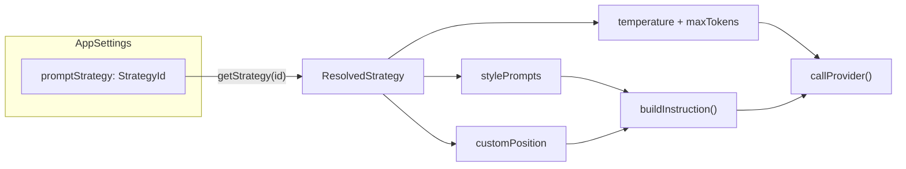
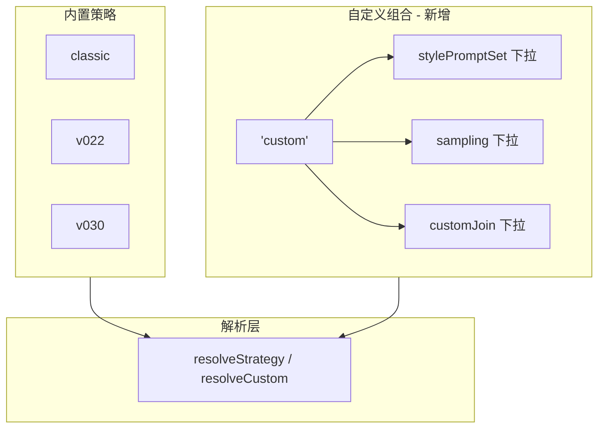
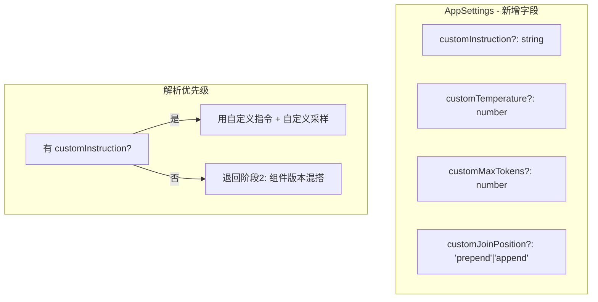

# 策略系统三阶段演进方案

## 当前数据流



---

## 阶段 1：历史记录加策略归因

**目标**：每次提取时记录当时用的策略 id，用户在提示词库里能看到"这条是用哪个策略提的"。

### 涉及文件

- [src/lib/types.ts](src/lib/types.ts) — `HistoryItem` 增加 `strategy?: StrategyId` 字段；`PromptVersion.meta` 增加 `strategy?: StrategyId`
- [src/background/index.ts](src/background/index.ts) — `persistHistory` 传入 `strategy` 字段并写入 `HistoryItem` 和初始 `PromptVersion.meta`
- [src/options/PromptLibrary/tabs/MetaTab.tsx](src/options/PromptLibrary/tabs/MetaTab.tsx) — 展示策略标签（读 `STRATEGY_LABELS[item.strategy]`）
- [src/options/PromptLibrary/tabs/VersionsTab.tsx](src/options/PromptLibrary/tabs/VersionsTab.tsx) — 版本列表每条若有 `meta.strategy` 也显示

### 关键改动

```typescript
// types.ts — HistoryItem 增加字段
export interface HistoryItem {
  // ... existing fields ...
  strategy?: StrategyId;  // 新增：提取时使用的策略
}

// types.ts — PromptVersion.meta 增加字段
meta?: { provider: ProviderId; model: string; style: OutputStyle; strategy?: StrategyId };

// background/index.ts — persistHistory 传参
const item: HistoryItem = {
  // ... existing ...
  strategy: params.strategy,  // 新增
  versions: [{
    // ...
    meta: { provider, model, style, strategy: params.strategy },
  }],
};
```

**改动量**：约 20 行，零风险。

---

## 阶段 2：自由组合已有组件版本

**目标**：在设置页增加"自定义组合"策略卡片，点击后展开 3 个下拉框，用户可以混搭不同版本的指令集/采样/拼接。

### 架构变更



### 涉及文件

- [src/lib/strategies-meta.ts](src/lib/strategies-meta.ts) — `STRATEGIES_INTERNAL` 增加 `'custom'` key（占位定义）
- [src/lib/types.ts](src/lib/types.ts) — `AppSettings` 增加 `customComponents?: StrategyComponents`
- [src/lib/strategies.ts](src/lib/strategies.ts) — 新增 `resolveCustomStrategy(components)` 函数；`getStrategyList()` 把 custom 排到末尾并标记特殊
- [src/lib/api/extract.ts](src/lib/api/extract.ts) — 当 `promptStrategy === 'custom'` 时用 `resolveCustomStrategy(settings.customComponents)` 替代 `getStrategy`
- [src/lib/storage/settings.ts](src/lib/storage/settings.ts) — `defaultSettings()` 增加 `customComponents` 的默认值
- [src/options/SettingsView.tsx](src/options/SettingsView.tsx) — 策略版本区增加自定义组合卡片 + 3 个下拉框
- [src/content/panel/templates.ts](src/content/panel/templates.ts) / [events.ts](src/content/panel/events.ts) — 面板策略选择器需支持 custom

### 关键改动

**strategies-meta.ts** — 在 `STRATEGIES_INTERNAL` 末尾追加：

```typescript
custom: {
  label: '自定义组合',
  description: '自由混搭已有的指令集、采样参数、拼接方式。适合对比实验和高级调优。',
  components: {
    stylePromptSet: 'v0.3.0',  // 默认值，实际运行时被 AppSettings.customComponents 覆盖
    sampling: 'v0.3.0',
    customJoin: 'v0.3.0',
  },
},
```

**strategies.ts** — 新增解析函数：

```typescript
export function resolveCustomStrategy(components: StrategyComponents): ResolvedStrategy {
  const sp = STYLE_PROMPT_SETS[components.stylePromptSet];
  const sm = SAMPLING_PROFILES[components.sampling];
  const cj = CUSTOM_JOINS[components.customJoin];
  if (!sp || !sm || cj === undefined) {
    throw new Error(`[strategies] 自定义组合引用了不存在的组件版本`);
  }
  return {
    id: 'custom',
    label: '自定义组合',
    description: `指令集@${components.stylePromptSet} · 采样@${components.sampling} · 拼接@${components.customJoin}`,
    components,
    stylePrompts: sp,
    temperature: sm.temperature,
    maxTokens: sm.maxTokens,
    customPosition: cj,
  };
}
```

**extract.ts** — 策略解析逻辑调整：

```typescript
const strategy = (settings.promptStrategy === 'custom' && settings.customComponents)
  ? resolveCustomStrategy(settings.customComponents)
  : getStrategy(settings.promptStrategy);
```

**SettingsView.tsx** — 当选中 custom 时，卡片下方展开 3 个下拉框：

- 指令集版本：`Object.keys(STYLE_PROMPT_SETS)` — 每个选项附带一行说明
- 采样参数：`Object.keys(SAMPLING_PROFILES)` — 显示 temperature + maxTokens
- 拼接方式：`Object.keys(CUSTOM_JOINS)` — 显示 prepend / append

**改动量**：约 150-200 行，中等复杂度。

### UI 草稿

custom 卡片展开后的结构：

```
┌──────────────────────────────────────────┐
│  自定义组合                        [生效中] │
│  自由混搭已有的指令集、采样参数、拼接方式   │
│                                          │
│  指令集版本  [v0.3.0 ▾]                   │
│    ↳ 8维度分句/具名风格锚定/摄影参数       │
│                                          │
│  采样参数    [v0.3.0 ▾]                   │
│    ↳ temperature 0.3 · max_tokens 1536    │
│                                          │
│  拼接方式    [v0.3.0 ▾]                   │
│    ↳ 自定义模板前置                       │
└──────────────────────────────────────────┘
```

---

## 阶段 3：完全自定义策略（指令 + 采样参数）

**目标**：允许用户完全自写指令模板，自定温度/token上限，最大化灵活性。

### 架构变更

在阶段 2 的基础上，`AppSettings` 再增加 `customInstruction` 相关字段；解析时若检测到自定义指令文本，优先使用它替代 `STYLE_PROMPT_SETS` 里的内置文本。



### 涉及文件

- [src/lib/types.ts](src/lib/types.ts) — `AppSettings` 增加自定义指令/采样字段
- [src/lib/strategies.ts](src/lib/strategies.ts) — `resolveCustomStrategy` 扩展支持自定义指令文本
- [src/lib/storage/settings.ts](src/lib/storage/settings.ts) — 默认值
- [src/options/SettingsView.tsx](src/options/SettingsView.tsx) — custom 卡片展开时增加"高级"折叠区：指令编辑器 + 温度滑块 + maxTokens 输入

### 关键改动

**types.ts** — AppSettings 扩展：

```typescript
export interface AppSettings {
  // ... existing + phase2 fields ...
  /** 完全自定义指令文本（仅 promptStrategy === 'custom' 时生效） */
  customInstruction?: string;
  /** 自定义温度（覆盖 sampling 版本） */
  customTemperature?: number;
  /** 自定义 token 上限（覆盖 sampling 版本） */
  customMaxTokens?: number;
}
```

**strategies.ts** — 解析逻辑扩展：

```typescript
export function resolveCustomStrategy(
  components: StrategyComponents,
  overrides?: {
    instruction?: string;
    temperature?: number;
    maxTokens?: number;
    joinPosition?: CustomJoinPosition;
  }
): ResolvedStrategy {
  const sp = STYLE_PROMPT_SETS[components.stylePromptSet];
  const sm = SAMPLING_PROFILES[components.sampling];
  const cj = CUSTOM_JOINS[components.customJoin];
  // ... validation ...

  const resolved: ResolvedStrategy = { /* ... base from components ... */ };

  // 自定义覆盖层
  if (overrides?.instruction) {
    // 用同一份自定义指令覆盖所有 outputStyle
    for (const key of Object.keys(resolved.stylePrompts) as OutputStyle[]) {
      resolved.stylePrompts[key] = overrides.instruction;
    }
  }
  if (overrides?.temperature != null) resolved.temperature = overrides.temperature;
  if (overrides?.maxTokens != null) resolved.maxTokens = overrides.maxTokens;
  if (overrides?.joinPosition) resolved.customPosition = overrides.joinPosition;

  return resolved;
}
```

**SettingsView.tsx** — custom 卡片增加折叠式高级区：

```
┌──────────────────────────────────────────────┐
│  自定义组合                            [生效中] │
│                                              │
│  ▸ 组件版本混搭（阶段2的3个下拉框）            │
│                                              │
│  ▾ 高级覆盖                                  │
│  ┌────────────────────────────────────────┐  │
│  │ 自定义指令模板                          │  │
│  │ ┌──────────────────────────────────┐  │  │
│  │ │ (textarea, monospace, 可多行)     │  │  │
│  │ │ 留空则使用上方选择的指令集版本      │  │  │
│  │ └──────────────────────────────────┘  │  │
│  │                                      │  │
│  │ 温度  [━━━━●━━━━] 0.3                │  │
│  │        0.0            1.0            │  │
│  │                                      │  │
│  │ Token 上限  [1536]                   │  │
│  │                                      │  │
│  │ 拼接位置  ○ 前置  ● 追加             │  │
│  └────────────────────────────────────────┘  │
└──────────────────────────────────────────────┘
```

**改动量**：约 200-300 行。

---

## 数据迁移兼容性

- 所有新增字段均为 `optional`（`?`），老 settings 无此字段时 `getSettings()` 合并默认值，零迁移成本
- `HistoryItem.strategy` 老数据没有该字段，UI 显示"未知策略"即可
- `StrategyId` 新增 `'custom'` 后，老用户存的 classic / v022 / v030 不受影响
- `getStrategy('custom')` 在没有 customComponents 时退回默认组件版本（STRATEGIES_INTERNAL 里的占位值）

## 实施顺序

三个阶段可以在同一个 PR 中按顺序实施，每完成一阶段可独立验证：

1. 阶段 1 完成后 → `npm run lint` 确认类型正确 → 提取一张图 → 打开提示词库检查策略标签
2. 阶段 2 完成后 → 设置页选择"自定义组合" → 混搭不同版本 → 提取验证效果
3. 阶段 3 完成后 → 写自定义指令 → 调温度 → 提取验证效果
