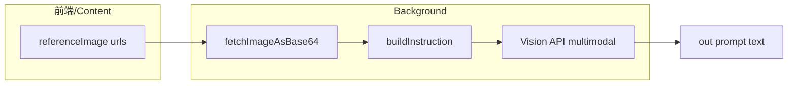

# 原生策略（图像直送模型识词）

## 背景结论（避免重复造轮子）

当前 [`src/lib/api/extract.ts`](d:\code\Code Experiment\Prompt extraction\src\lib\api\extract.ts) 已将参考图转成 `FetchedImage`，并在 [`callOpenAICompatible`](d:\code\Code Experiment\Prompt extraction\src\lib\api\providers\openai.ts) / Anthropic / Gemini 中以多模态 `user` 消息发出；你说的「直接把图发给模型、模型吐提示词」**已是主干流程**。新增「原生策略」= 在用户可见的「策略版本」里多一档：**更短的系统侧指令**，并按你的选择 **固定一种输出口径，忽略 `settings.outputStyle` 四档切换**。

## 行为契约（你已确认：`ignore_output_style`）

| 维度 | 行为 |
|------|------|
| 指令文案 | 新增独立 `STYLE_PROMPT_SET` 版本（如 `v_native`），四套 key 可先填**同一条极简中文**，强调：只输出提示词正文、禁 Markdown/前言、看不清勿编。 |
| 输出风格下拉 | **`native` 策略下不读取** `settings.outputStyle`：`buildInstruction` 与返回值里的 `style` 一律按固定键 **`natural-zh`**（与当前扩展主语种一致）；历史记录里策略字段仍为 `native`，避免用户误以为当时是 SD-tags/MJ 档生成的。 |
| 自定义模板 | 继续使用现有 **`customPosition`**（与同档位的 `prepend`/`append` 组合一致），让「原生 + 你自己的一句偏好」仍可生效。 |
| 多图/视频分镜/材质画风限定 | **保持现有追加逻辑**（`MULTI_IMAGE_INSTRUCTION_NOTE`、`appendExtractFocusInstruction`、`appendVideoSegmentInstruction`），避免行为分叉；若你希望原生档也「绝对零追加」，可作为后续微调项。 |

## 代码改动点（按文件）

1. **[`src/lib/strategies-meta.ts`](d:\code\Code Experiment\Prompt extraction\src\lib\strategies-meta.ts)**  
   - 在 `StylePromptSetVersion` 增加 `'v_native'`。  
   - 在 `STRATEGIES_INTERNAL` 增加条目，例如 `native`：**label**「原生识别」**，**description** 说明图像直送 VLM、无复杂维度清单、`输出风格档位不生效`。**components**：`stylePromptSet: 'v_native'`，采样/拼接可先 **复用 `v0.3.0`**（temperature 0.3 / max_tokens 1536 + prepend），与现有高还原档对齐；若想更「奔放」再单开 `SamplingVersion`（次要，首版可避免类型膨胀）。

2. **[`src/lib/strategies.ts`](d:\code\Code Experiment\Prompt extraction\src\lib\strategies.ts)**  
   - 注册 `STYLE_PROMPT_SETS['v0.native']` 或字面名 `'v_native'`（与 meta 对齐），四套 `OutputStyle` 同一极简中文（或可中英各一条再在 extract 固定选 zh——首版四套相同最省事）。

3. **[`src/lib/api/extract.ts`](d:\code\Code Experiment\Prompt extraction\src\lib\api\extract.ts)**  
   - **`buildInstruction`**：当 `strategy.id === 'native'` 时，`base` 取自 `strategy.stylePrompts['natural-zh']`（或常量），**不要使用** `settings.outputStyle`。  
   - **`ExtractResult`**：`style` 在 `strategy.id === 'native'` 时写死返回 `'natural-zh'`，与 history / `EXTRACT_RESULT` payload 一致。  
   - 可用小函数 `effectiveOutputStyleForExtract(settings, strategy)` 集中两处逻辑，避免重复。

4. **[`src/options/SettingsView.tsx`](d:\code\Code Experiment\Prompt extraction\src\options\SettingsView.tsx)**  
   - **`STYLE_PROMPT_SET_LABELS`** 增加 `'v_native'` 一行说明。  
   - 在「输出风格」区域：当 `settings.promptStrategy === 'native'` 时展示**简短说明**（档位不作用于本次反推，仅为切换其他策略时的预设）。

5. **自动跟进的 Consumer（通常无需手写枚举）**  
   - **`STRATEGY_LABELS`**、设置页策略卡片、`content` 下拉（[`templates.ts`](d:\code\Code Experiment\Prompt extraction\src\content\panel\templates.ts) 等）由新增 `StrategyId` 自动生成；若有 E2E/脚本硬编码策略列表（如 [`scripts/test-version-state.mjs`](d:\code\Code Experiment\Prompt extraction\scripts\test-version-state.mjs)），按需补上 `native`。

6. **文档/商店文案（可选）**  
   - 若希望在 [`store-listing`](d:\code\Code Experiment\Prompt extraction\store-listing) 说明「Vision 原生识词档位」，可加一句特性描述（非必选）。

## 风险与前置条件

- **必须**：当前 Provider **模型具备视觉能力**，否则仍会走同一请求体并可能报 API 错——与现有一致，可在说明书里点名「请先选 Vision 模型」。  
- **`refine`** 路径仍只吃文本 [`refine.ts`](d:\code\Code Experiment\Prompt extraction\src\lib\api\refine.ts)；本次不改精修语义。
