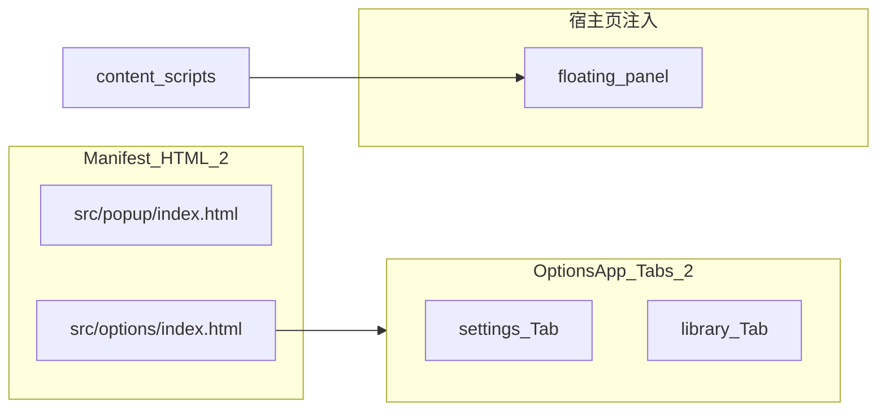

# 插件页面统计（当前代码库）

盘点扩展在 Manifest、选项页 Tabs 与网页内注入 UI 的分层口径，便于写商店说明或与新人对齐架构。

权威定义见源码：[`src/manifest.config.ts`](../src/manifest.config.ts)。

---

## Manifest 定义的独立扩展页（`chrome-extension://…`）

| 类型           | HTML 路径              | React 挂载                                      |
|----------------|-------------------------|-------------------------------------------------|
| 工具栏弹窗     | `src/popup/index.html`  | `src/popup/main.tsx` → `PopupApp.tsx`           |
| 选项页         | `src/options/index.html` | `src/options/main.tsx` → `OptionsApp.tsx`       |

**合计：2 个顶层页面。**

未发现 `devtools_page`、`side_panel`、`offscreen`、书签/新标签页替换等额外 manifest 页面。

---

## Options 内部的子界面（同一 HTML，Tab 切换）

[`OptionsApp.tsx`](../src/options/OptionsApp.tsx) 使用本地 state `tab: 'settings' | 'library'` 切换视图（非 React Router）；支持 hash 深链 `#tab=library&focus=…`：

- **settings**：[`SettingsView`](../src/options/SettingsView.tsx)（内含 [`SetupGuide`](../src/options/SetupGuide.tsx) 等折叠区块，仍为同一 Tab）。
- **library**：[`PromptLibrary`](../src/options/PromptLibrary/index.tsx)。

**合计：2 个选项页内主要视图 Tab。**

---

## 网页内 UI（不是独立扩展页）

- **内容脚本浮动面板**：由 [`src/content/index.ts`](../src/content/index.ts) 与 [`src/content/panel/`](../src/content/panel) 在宿主页 Shadow DOM / 模板字符串中渲染，**无单独 HTML URL**，与用户网页共用文档。

---

## 结构示意

---

## 口径说明

- 若只说 **Chrome 意义上的「扩展页面」**：**2**。
- 若算上 **用户在设置里能切换的主界面**：**2 + 2 = 4** 个常用界面（popup + options 两 Tab；或表述为 popup 1 + options 内 2）。
- 若算上 **网页里出现的提取面板**：再 **+1 类**交互面（仍非单独 manifest 页面）。

---

## 开发时 UI 预览（与源码 / HMR 同步）

1. 根目录执行 `npm run dev`（默认 `http://localhost:5173`）。就绪后 Vite 会**自动用系统默认浏览器**打开 **`http://localhost:5173/__dev__/ui-preview`**。若只希望起本地服务、不自动弹窗，可设置环境变量 `DEV_PREVIEW_NO_OPEN=1`（Windows PowerShell：`$env:DEV_PREVIEW_NO_OPEN='1'; npm run dev`）。
2. **`http://localhost:5173/__dev__/ui-preview`**（聚合页以标签在三壳之间切换）：可选 **`#popup`** / **`#options`** / **`#panel`**；iframe 内为真实 `PopupApp` / `OptionsApp` 与 `panelHtml` + 面板 `STYLE`。源码见 [`src/dev/preview/`](../src/dev/preview/) 与垫片 [`chromeShim.ts`](../src/dev/preview/chromeShim.ts）。

离线说明与直连子页链接见 [`plugin-pages-style-preview.html`](plugin-pages-style-preview.html)。
